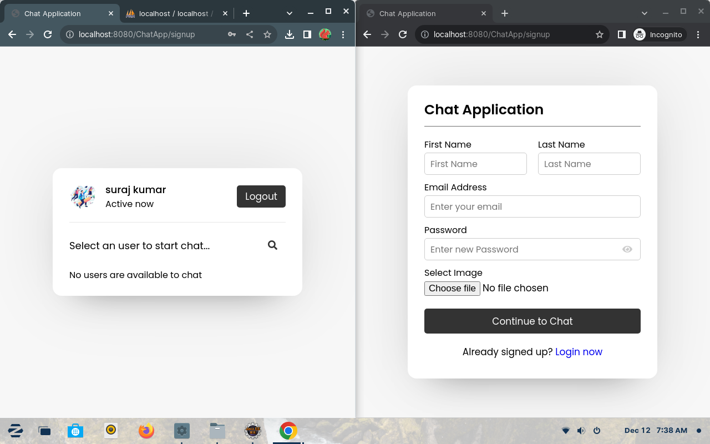
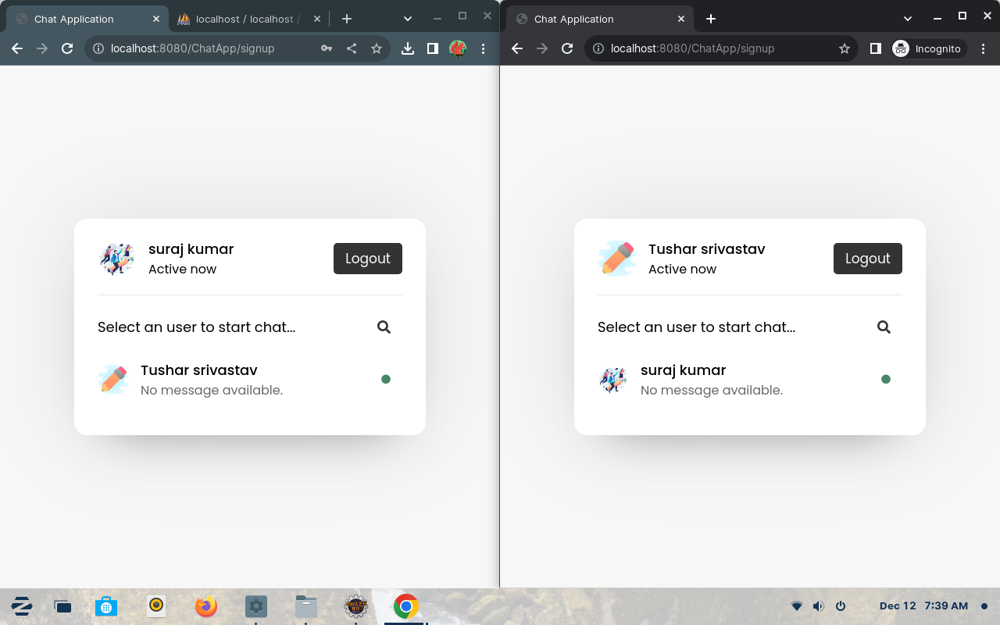
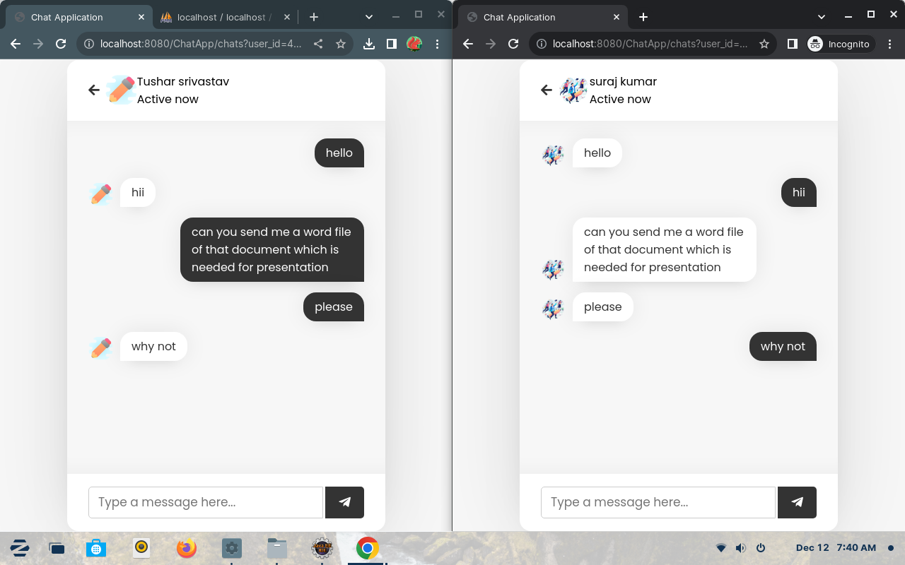
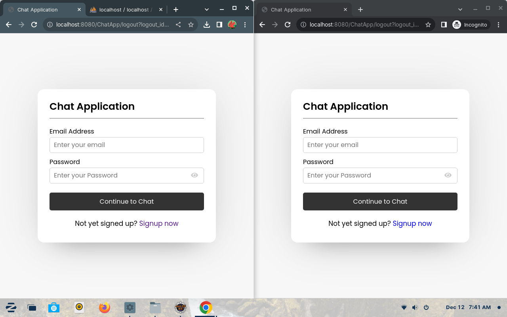

# WebChatApplication

In my studing year of computer science studies, I was eager to apply what I learned in the classroom to a practical project. This WebChatApplication is the result of that ambition. Using Java Servlets, JSP, and MySQL, I developed a web-based chat application that demonstrates my ability to build full-stack applications and tackle real-world problems.

A web-based chat application built with Java, featuring real-time messaging using Servlets, JSP, MySQL, CSS, and JavaScript. Requires Apache Tomcat 10 or later. Deploy and chat with friends, or distribute as a WAR file with a remote database.

## Features

* Real-time chat functionality.
* User authentication and registration.
* Database-driven message storage.
* Responsive design.

## Technologies Used

* **Backend:** Java Servlets, JSP
* **Frontend:** HTML, CSS, JavaScript
* **Database:** MySQL
* **Server:** Apache Tomcat 10+
* **IDE:** Eclipse Enterprise Edition

## Screenshots

<div style="display: flex; flex-wrap: wrap; justify-content: space-around;">
    
    
    
    
</div>

## Getting Started

Follow these steps to set up and run the WebChatApplication on your local machine.

1.  **Prerequisites:**
    * Eclipse Enterprise Edition IDE
    * Apache Tomcat 10+
    * MySQL Database
    * Java Development Kit (JDK)

2.  **Import Project:**
    * Download or clone the repository.
    * In Eclipse, go to `File > Open Project from File System...`.
    * Select the project directory and click `Finish`.

3.  **Install Web Development Tools (If Needed):**
    * Go to `Help > Eclipse Marketplace...`.
    * Search for "Eclipse Enterprise Java and Web Developer Tools" and install.

4.  **Configure Tomcat Server:**
    * Go to `Window > Show View > Servers`.
    * Click "No servers are available. Click this link to create a new server...".
    * Select your Tomcat version and click `Next`.
    * Browse to your Tomcat installation directory and click `Finish`.

5.  **Database Setup:**
    * **Using phpMyAdmin:**
        * Create a database named `chat`.
        * Import the `database/chat.sql` file.
    * **Using MySQL Command Line or Workbench:**
        * Run the following SQL commands:

        ```sql
        CREATE DATABASE chat;
        USE chat;
        CREATE TABLE `messages` (
            `msg_id` int(20) NOT NULL AUTO_INCREMENT,
            `incoming_msg_id` varchar(255) NOT NULL,
            `outgoing_msg_id` varchar(255) NOT NULL,
            `msg` varchar(1000) NOT NULL,
            PRIMARY KEY (`msg_id`)
        ) AUTO_INCREMENT = 100;
        CREATE TABLE `users` (
            `user_id` int(11) NOT NULL AUTO_INCREMENT,
            `unique_id` varchar(200) NOT NULL,
            `fname` varchar(255) NOT NULL,
            `lname` varchar(255) NOT NULL,
            `email` varchar(255) NOT NULL,
            `password` varchar(255) NOT NULL,
            `img` varchar(400) NOT NULL,
            `status` varchar(255) NOT NULL,
            PRIMARY KEY (`user_id`)
        ) AUTO_INCREMENT = 100;
        ```

6.  **Run the Application:**
    * Right-click on the project in Eclipse.
    * Select `Run As > Run on Server`.
    * Choose your Tomcat server and click `Finish`.

7.  **Access the Application:**
    * Open your web browser and go to `http://localhost:8080/WebChatApp/`.

## Deployment

To deploy this application to other environments, you can create a WAR file from eclipse, and then deploy that WAR file to any web server that supports the java servlets and JSP.

## Contributing

Pull requests are welcome. For major changes, please open an issue first to discuss what you would like to change.

Please ensure tests are updated as appropriate.
